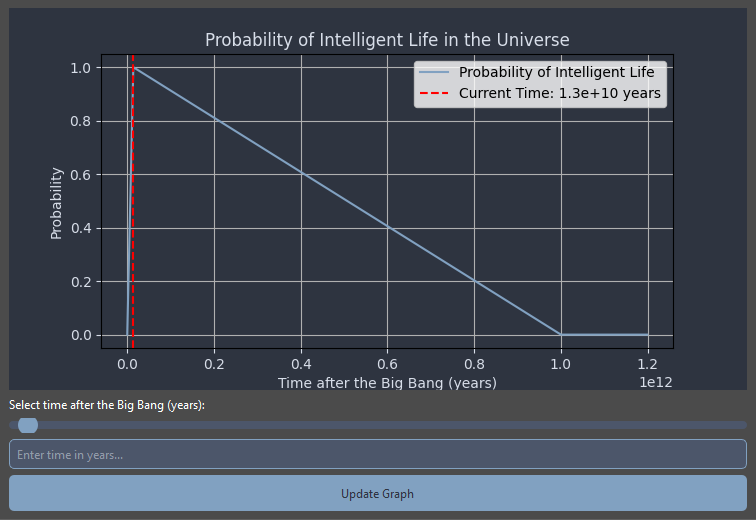
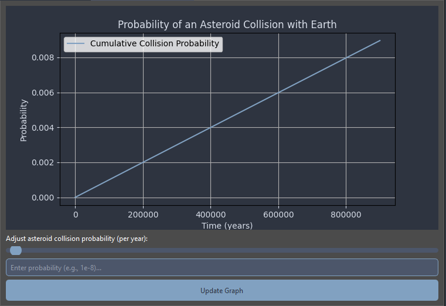

# Cosmic Odyssey 🌌

Welcome to **Cosmic Odyssey**, a fun and educational project that combines science, philosophy, and a touch of humor to explore the mysteries of the universe! 🚀

---

## What is Cosmic Odyssey? 🤔

Cosmic Odyssey is a **Python-based desktop application** built with **PyQt6** that lets you dive into two fascinating topics:

1. **Intelligent Life Probability**:
   - Explore the probability of intelligent life existing in the universe over time.
   - Visualize how this probability changes from the Big Bang to the distant future when stars begin to die.

2. **Asteroid Collision Probability**:
   - Calculate the likelihood of an asteroid colliding with Earth over time.
   - Understand how small probabilities add up over millions of years.

---

## Why Cosmic Odyssey? 🌠

This project is both a **joke** and an **educational tool**:

- **It's a joke** because, let's be honest, who hasn't wondered about the meaning of life while staring at the stars? 🌌
- **It's educational** because it uses real scientific concepts (like probability and cosmology) to make you think about the universe and our place in it.

Whether you're a space enthusiast, a Python beginner, or just someone who loves to ponder the big questions, Cosmic Odyssey is for you!

---

## Features 🛠️

- **Interactive Graphs**:
  - Visualize the probability of intelligent life and asteroid collisions over time.
  - Adjust parameters with sliders and input fields.

- **Cosmic Theme**:
  - A dark, space-themed interface with smooth animations and calming vibes.

- **Educational Insights**:
  - Learn about the age of the universe, the lifecycle of stars, and the math behind probabilities.

---

## How to Run 🚀

1. **Install Dependencies**:
   Make sure you have Python 3.10+ installed. Then, install the required libraries:

   ```bash
   pip install PyQt6 matplotlib
   ```

   Or:

   ```bash
   pip install -r requirements.txt
   ```

2. **Download the Code**:
   Clone this repository or download .zip.

3. **Run the Application**:
   Navigate to the project directory and run:

   ```bash
   python main.py
   ```

4. **Explore the Universe**:
   - Switch between tabs to explore intelligent life and asteroid collision probabilities.
   - Adjust sliders and input fields to see how probabilities change over time.

---

## Screenshots 📸

### Intelligent Life Probability Tab



### Asteroid Collision Probability Tab



---

## Why This Project Exists 🎯

Cosmic Odyssey was created to:

- **Inspire curiosity** about the universe and our place in it.
- **Make science fun** by combining education with humor and interactivity.
- **Encourage learning** by providing a hands-on way to explore complex topics.

---

## Contributing 🤝

Feel free to contribute to Cosmic Odyssey! Whether it's fixing bugs, adding new features, or improving the interface, your help is welcome. Just fork the repository, make your changes, and submit a pull request.

---

## License 📜

This project is licensed under the **MIT License**. Feel free to use, modify, and share it!

---

## Final Thoughts 🌟

Cosmic Odyssey is more than just a project—it's a journey. A journey to explore the universe, to ask big questions, and to have fun while doing it. So, what are you waiting for? Dive in and start your own cosmic odyssey!

---

Made with ❤️ and a sprinkle of stardust by NazarHK.  
🚀 **Keep exploring!** 🚀
